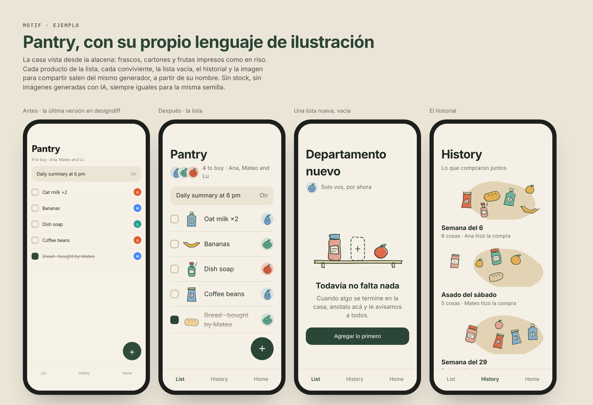
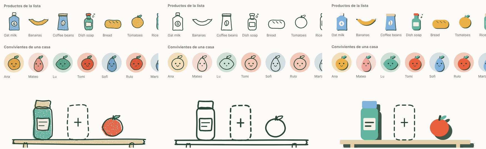
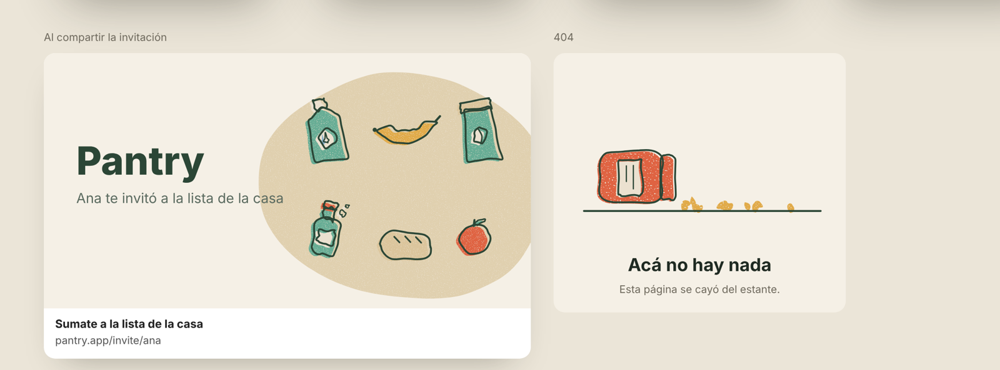
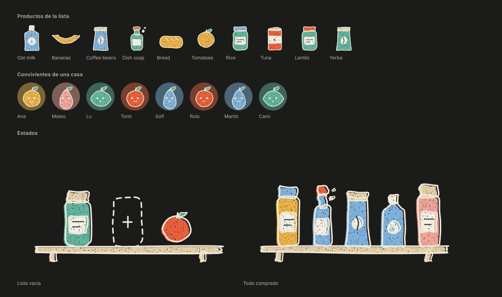

# motif

**English** · [Español](#español)

Most apps get their illustrations from a stock pack that looks like every other app, from AI image generators that look like every other AI app, or from nothing: initials in circles, a grey placeholder, a screen that says "No items".

**motif gives a product its own illustration language, written as code.** It reads the project, finds the world the product lives in, proposes three illustration languages drawn from that world, and builds the one you choose as a small generator inside your project. From then on every image the product needs (each list item, each person, each empty state, each cover, each share image) is drawn by that code from a seed, in the same hand, forever consistent.



*Pantry is the fictional grocery list from [designdiff](https://github.com/tomasgposse/designdiff)'s example. On the left, its last version; on the right, the same app with its motif language. Everything lives in [`examples/pantry`](examples/pantry).*

## What it does

1. **Surveys the project**: brand colors, fonts and radii, existing assets, and every place that asks for an image today (empty-state copy, initials avatars, 404, onboarding, OG metadata, placeholder services).
2. **Reads it like an art director**: what the product is, and what **world** it lives in. Not the interface: the life. A grocery list lives in a cupboard of jars, cartons and fruit.
3. **Proposes three languages**, each a world and a hand, with a rendered specimen of each so you choose by looking, not by adjectives.
4. **Builds your choice as code** in your project: a dependency-free engine plus `<product>-art.mjs` with the palette (your exact tokens), the motifs and a composition per slot. Same seed, same drawing; different seeds, different drawings.
5. **Checks it** with a specimen sheet: determinism, variety, id clashes, weight, contrast. Then the part no script can do: looking at it until it's one hand.
6. **Wires it into the app**: avatars replace initials (distinct for every person in the same group), empty states point to the action, covers show each collection's own contents, share images are exported as PNG.
7. **Leaves an `ILLUSTRATION.md`** with the world, the grammar, the rules and how to add a motif, so the next session draws in the same hand.







## Why it's different

| | Stock packs (unDraw, Blush) | AI image generators | Avatar libraries (DiceBear, Boring Avatars) | **motif** |
|---|---|---|---|---|
| Comes from your product's world | No | Only if you prompt well each time | No | **Yes: it's the first step** |
| Uses your exact tokens | Recolor by hand | No | Palette only | **Yes** |
| Every list, person or item gets its own image | No | One prompt per image | Avatars only | **Every slot, from a seed** |
| Same input, same image, forever | Yes | No | Yes | **Yes** |
| Lives in your code, renders on the server | No | No | Yes | **Yes, no dependencies** |

## Install

```bash
git clone https://github.com/tomasgposse/motif ~/.claude/skills/motif
```

Or copy the folder into your project's `.claude/skills/`. Then ask things like:

> "Our empty states are just text, give the app some illustrations"
> "Replace the initials avatars with something that feels like us"
> "We need OG images and covers for each project"

**Requirements:** Node 22+. Chrome or Edge for the specimen screenshots and PNG export (`MOTIF_BROWSER` if it's somewhere unusual). The generated code has no dependencies and runs in the browser, in Node and on the server.

## Run the example

```bash
cd examples/pantry
node build.mjs                                            # index.html: before and after
node ../../scripts/specimen.mjs pantry-art.mjs --styles riso,line,blocks
node ../../scripts/export.mjs pantry-art.mjs og '[{"title":"Pantry"}]' --out og.png
```

## What's inside

| File | What it's for |
|---|---|
| `SKILL.md` | The workflow the agent follows |
| `references/language.md` | How to find a product's world and design a hand for it, and how to shape the three proposals |
| `references/craft.md` | One hand, seeds, identity, small sizes, composition, accessibility, dark mode, weight |
| `references/slots.md` | Every place a product needs images, what each one is for and what to draw |
| `templates/engine.mjs` | The engine copied into the project: seeded randomness, hand-drawn shapes, three hands (riso, line, blocks), layout helpers |
| `scripts/survey.mjs` | Brand tokens, assets and the slots that need images |
| `scripts/specimen.mjs` | Specimen sheet with checks (light or `--dark`) |
| `scripts/export.mjs` | Any composition to PNG (share images, icons) |
| `examples/pantry/` | A complete language: `pantry-art.mjs`, `ILLUSTRATION.md`, the before/after page |
| `tests/` | `node --test tests/*.test.mjs` |

## License

MIT

---

## Español

La mayoría de las apps sacan sus ilustraciones de tres lugares: un pack de stock que se parece a todas las apps, un generador de imágenes con IA que se parece a todas las apps hechas con IA, o de ningún lado (iniciales en círculos, un gris de relleno, una pantalla que dice "No hay elementos").

**motif le da a un producto su propio lenguaje de ilustración, escrito como código.** Lee el proyecto, encuentra el mundo en el que vive el producto, propone tres lenguajes de ilustración sacados de ese mundo y construye el que elijas como un generador chico dentro del proyecto. A partir de ahí, cada imagen que el producto necesita (cada producto de una lista, cada persona, cada estado vacío, cada portada, cada imagen para compartir) la dibuja ese código a partir de una semilla, con la misma mano, siempre igual.

*Pantry es la lista de compras ficticia del ejemplo de [designdiff](https://github.com/tomasgposse/designdiff). A la izquierda, su última versión; a la derecha, la misma app con su lenguaje de motif. Todo está en [`examples/pantry`](examples/pantry).*

## Qué hace

1. **Releva el proyecto**: colores, tipografías y radios de la marca, las imágenes que ya tiene y cada lugar que hoy pide una imagen (textos de estado vacío, avatares con iniciales, 404, onboarding, metadatos OG, servicios de relleno).
2. **Lo lee como un director de arte**: qué es el producto y en qué **mundo** vive. No la interfaz: la vida. Una lista de compras vive en una alacena de frascos, cartones y frutas.
3. **Propone tres lenguajes**, cada uno un mundo y una mano, con una hoja de muestra renderizada de cada uno, para elegir mirando y no con adjetivos.
4. **Construye el elegido como código** en tu proyecto: un motor sin dependencias más `<producto>-art.mjs` con la paleta (tus tokens exactos), los motivos y una composición por cada lugar. La misma semilla da el mismo dibujo; semillas distintas, dibujos distintos.
5. **Lo revisa** con una hoja de muestra: determinismo, variedad, ids que no choquen, peso y contraste. Y después lo que ningún script hace: mirarlo hasta que sea una sola mano.
6. **Lo conecta a la app**: los avatares reemplazan las iniciales (distintos para cada persona del mismo grupo), los estados vacíos apuntan a la acción, las portadas muestran el contenido de cada colección y las imágenes para compartir se exportan en PNG.
7. **Deja un `ILLUSTRATION.md`** con el mundo, la gramática, las reglas y cómo sumar un motivo, para que la próxima sesión dibuje con la misma mano.

## Instalación

```bash
git clone https://github.com/tomasgposse/motif ~/.claude/skills/motif
```

O copiá la carpeta en `.claude/skills/` de tu proyecto. Después pedile cosas como:

> "Los estados vacíos son solo texto, dale ilustraciones a la app"
> "Reemplazá los avatares con iniciales por algo que se sienta nuestro"
> "Necesitamos imágenes OG y portadas para cada proyecto"

**Requisitos:** Node 22+. Chrome o Edge para las capturas de la hoja de muestra y la exportación a PNG. El código que genera no tiene dependencias y corre en el navegador, en Node y en el servidor.

## Probar el ejemplo

```bash
cd examples/pantry
node build.mjs                                            # index.html: antes y después
node ../../scripts/specimen.mjs pantry-art.mjs --styles riso,line,blocks
node ../../scripts/export.mjs pantry-art.mjs og '[{"title":"Pantry"}]' --out og.png
```

## Licencia

MIT
